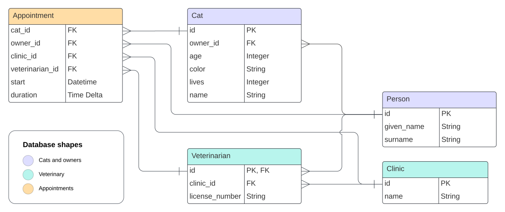

# Data Structures & Algorithms

An example of a real-world DS&A problem, commonly referred to as [N+1 Queries](https://docs.sentry.io/product/issues/issue-details/performance-issues/n-one-queries/).

@bryant-finney has encountered this problem several times in his career, and this example demonstrates how to recognize it in production.

## Background

Our team has built a web application that cat owners use to...

1. browse veterinarians at participating clinics
2. schedule their cats' veterinary appointments with their preferred provider

The application is built using Python's [Flask](https://flask.palletsprojects.com/en/3.0.x/quickstart/) web framework. [SQLAlchemy](https://docs.sqlalchemy.org/en/20/orm/quickstart.html) provides functionality for connecting to the database layer, and this repo defines the data structures and SQL queries for reading from the database.

## Problem

We recently launched a new _Success Stories_ page to advertize different clinics and the services they provide. We tested the page extensively in a QA environment, and we used an A/B testing strategy to verify things worked well in production (for a small subset of users).

However, this morning we were surprised to discover the production environment was down. All servers were had plateaued at 50% CPU utilization, and the application was completely unresponsive.

After connecting to the database, we saw the app was executing thousands of SQL queries every minute. Then, we connected to an application server and concluded the issue was caused by the [N+1 Queries](https://docs.sentry.io/product/issues/issue-details/performance-issues/n-one-queries/) problem.

See if you can spot the code responsible for this problem! Then, discuss ways we could fix it.

### Data Structures

The data structures used in this problem are located in [src/models.py](src/models.py). These structures model data stored in the database (called an ORM, or object-relational mapping).

The database schema follows:



Each table corresponds to a class in [src/models.py](src/models.py).

### Algorithms

[src/db.py](src/db.py) contains the code for connecting to the database and selecting data from it. In order to populate content in the new _Success Stories_ page, we needed write an algorithm to select all cats that had been treated at a given clinic (so that the front end could display the relevant cats' success stories). We implemented this algorithm in the [db.QueryMixin.list_cats_seen_at()](src/db.py#L61):

```python
 def list_cats_seen_at(self, clinic_name: str) -> list[models.Cat]:
     """Retrieve all cats seen at the given clinic."""

     clinic = self.get_clinic(clinic_name)
     veterinarians = self.list_veterinarians(clinic)

     all_cats: list[models.Cat] = []
     for veterinarian in veterinarians:
         appointments = self.get_appointments(veterinarian)
         for appointment in appointments:
             cat = self.get_cat(appointment)
             if cat not in all_cats:
                 all_cats.append(cat)

     return all_cats
```

We tested to make sure everything works with the [testing.ipynb](testing.ipynb) notebook.

## Project Setup

This project requires the following system dependencies. Follow each link to open the installation pages:

- [Python 3.8+](https://www.python.org/downloads/)
- [Poetry](https://python-poetry.org/docs/#installation)
  - There are multiple ways to install it; using [pipx](https://github.com/pypa/pipx) works well
  - To install `pipx`:
    ```sh
    # the following assumes python3 is installed on your system
    python3 -m pip install --user pipx &&
       python3 -m pipx ensurepath
    ```
  - And then to install `poetry`:
    ```sh
    pipx install poetry
    ```

With `poetry` installed, you can now clone the repo and install its dependencies:

```sh
git clone https://github.com/bryant-finney/python-dsa.git &&
   cd python-dsa

# install dependencies to a virtual environment
poetry install

# activate the virtual environment
poetry shell
```

After activating the virtual environment, you can reproduce our testing setup for [testing.ipynb](testing.ipynb) by executing the following command:

```sh
# generate test data and store it in the 'test.db' sqlite database
create-test-db

# or to generate a 'prod.db' database with a representative amount of data (this takes a few minutes)
create-prod-db
```

### Using with [VSCode](https://code.visualstudio.com/)

This project is set up to work with [VSCode](https://code.visualstudio.com/). Just run the following command to launch the project:

```sh
code python-dsa.code-workspace
```

When the editor opens, press `⌘ + ⇧ + x` (mac) / `ctrl + shift + x` (windows) to open the extensions view and search `@recommended` to list extensions recommended for this project.

Once the extensions are installed, you can open the [testing.ipynb](testing.ipynb) notebook and execute the cells.

### Using with [JupyterLab](https://jupyter.org/)

As an alternative to [VSCode](https://code.visualstudio.com/), you can use [JupyterLab](https://jupyter.org/) directly. Execute the following from within the virtual environment to open a local Jupyter server in your browser:

```sh
jupyter-lab
```
